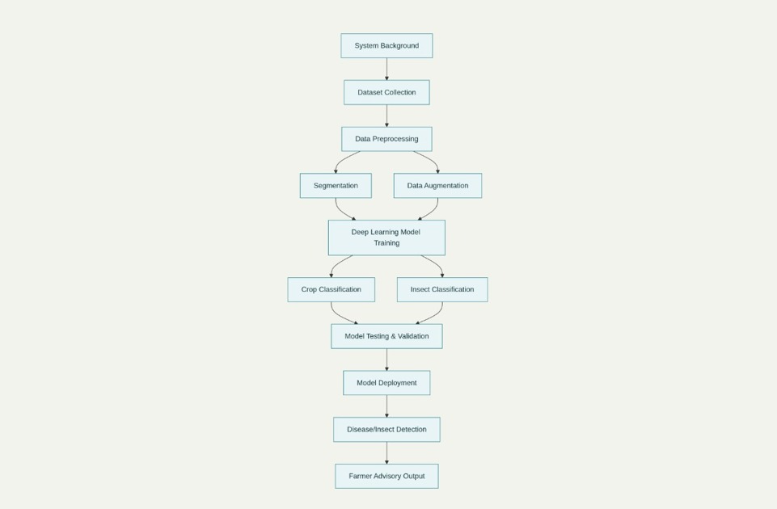

# Smart India Hackathon Workshop
# Date:28.09.2025
## Register Number:25016155
## Name:A.Aira Dario
## Problem Title
SIH 25010: Smart Crop Advisory System for Small and Marginal Farmers
## Problem Description
A majority of small and marginal farmers in India rely on traditional knowledge, local shopkeepers, or guesswork for crop selection, pest control, and fertilizer use. They lack access to personalized, real-time advisory services that account for soil type, weather conditions, and crop history. This often leads to poor yield, excessive input costs, and environmental degradation due to overuse of chemicals. Language barriers, low digital literacy, and absence of localized tools further limit their access to modern agri-tech resources.

Impact / Why this problem needs to be solved

Helping small farmers make informed decisions can significantly increase productivity, reduce costs, and improve livelihoods. It also contributes to sustainable farming practices, food security, and environmental conservation. A smart advisory solution can empower farmers with scientific insights in their native language and reduce dependency on unreliable third-party advice.

Expected Outcomes

• A multilingual, AI-based mobile app or chatbot that provides real-time, location-specific crop advisory.
• Soil health recommendations and fertilizer guidance.
• Weather-based alerts and predictive insights.
• Pest/disease detection via image uploads.
• Market price tracking.
• Voice support for low-literate users.
• Feedback and usage data collection for continuous improvement.

Relevant Stakeholders / Beneficiaries

• Small and marginal farmers
• Agricultural extension officers
• Government agriculture departments
• NGOs and cooperatives
• Agri-tech startups

Supporting Data

• 86% of Indian farmers are small or marginal (NABARD Report, 2022).
• Studies show ICT-based advisories can increase crop yield by 20–30%.

## Problem Creater's Organization
Government of Punjab

## Theme
Agriculture, FoodTech & Rural Development

## Proposed Solution
<h3>Our solution works like a digital guide for farmers. It starts by collecting crop images and other data, which is then cleaned and prepared. The system improves this data through segmentation and augmentation so that the AI learns better. A deep learning model is trained to recognize both crops and insects. Once tested and deployed, it can quickly detect crop diseases or insect attacks in the field. The most important step is that it doesn’t just stop at detection it gives farmers simple, practical advice they can follow to protect their crops, reduce losses, and increase yield.</h3>

## Technical Approach
<h3>Soil moisture sensors, weather stations, and crop health monitoring via drones for precision irrigation and fertilizer management.Soil moisture sensors, weather stations, and crop health monitoring via drones for precision irrigation and fertilizer management.</h3>

## Feasibility and Viability
<h3>Mobile apps, chatbots, and SMS/IVR systems are already proven technologies in rural India.AI/ML models for weather forecasts, soil health, and crop advisory can be developed using open datasets.Cloud platforms ensure scalability and low-cost deployment.High, since better advisory leads to increased yields, reduced input costs, and higher profits. Freemium app, agri-input company sponsorships, and government subsidies.</h3>

## Impact and Benefits
<h3>Provides small and marginal farmers with real-time, scientific crop advisory instead of relying on guesswork or local shopkeepers.Boosts crop yield and quality by offering soil health insights, weather-based alerts, and pest control guidance.Higher income for farmers through better yields and reduced losses.Creation of new opportunities in agri-tech, rural advisory services, and local entrepreneurship.</h3>

## Research and References
<h3>www.agrevolution.in</h3>
<h4>www.pickapp.farm</h4>
